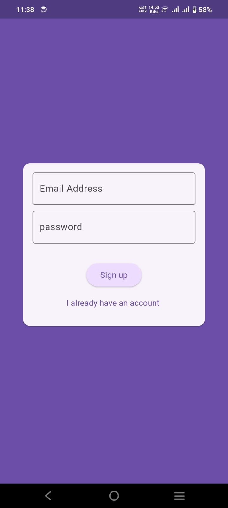
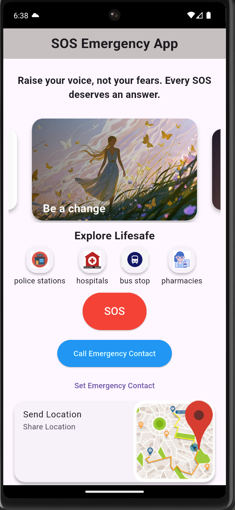
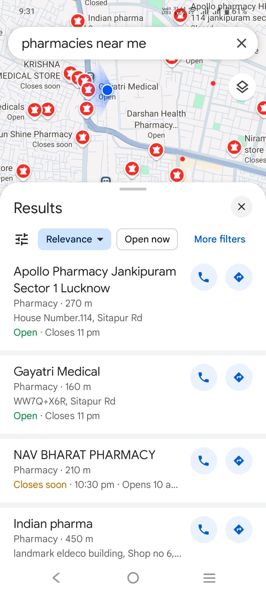
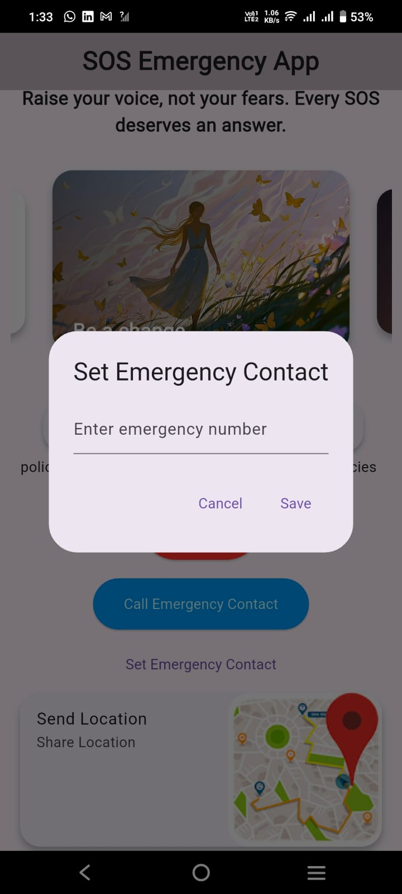
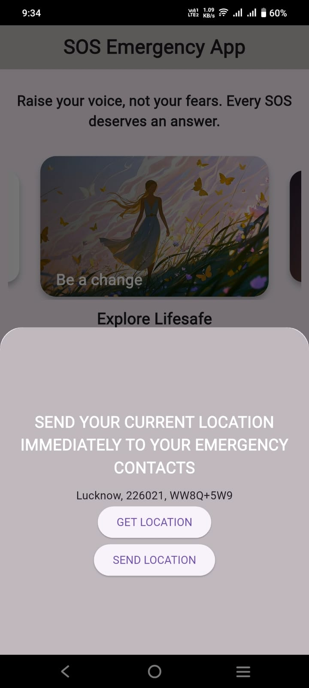

# SOS App

A Flutter-based SOS emergency application designed primarily for women's safety

### Table of Contents

- [User Authentication](#user-authentication)
- [Home Screen](#home-screen)
- [SOS Button and LifeSafe Section](#sos-button-and-lifesafe-section)
- [Emergency Contact](#emergency-contact)
- [Location Features](#location-features)

## User Authentication

- Signup and login functionality using email and password.

  

---

## Home Screen

- Displays motivational quotes for women.

  

---

## SOS Button and LifeSafe Section

- SOS Button: Instantly dials the police/emergency number.
- LifeSafe section includes 4 essential options:
  - Police Station – Shows nearby police stations.
  - Pharmacy – Shows nearby pharmacies.
  - Hospital – Shows nearby hospitals.
  - Bus Stop – Shows nearby bus stops.

  

---

## Emergency Contact

- Set a trusted emergency contact.
- Call your emergency contact anytime from the app.

  

---

## Location Features

- **Get Current Location** – Fetch your current GPS location.
- **Live Location** – Share your live location with your emergency contact.

  

